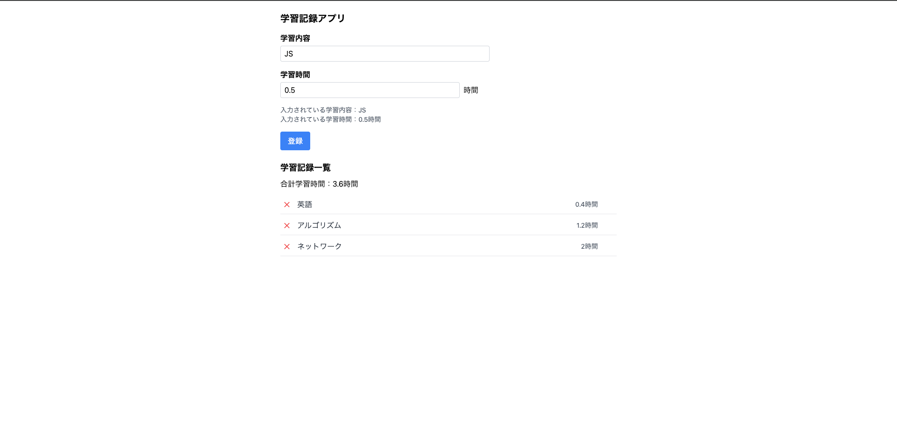

# 学習記録アプリ


[学習記録アプリ](https://study-report-79159.web.app)

🔐 セキュリティ補足：

本アプリは現在、ユーザー認証およびRLS未導入の状態で動作しています。
SupabaseのRow Level Security（RLS）については、将来的にAuth導入後に有効化することで、ユーザーごとのデータ分離を実装予定です。

## 📸 アプリ画面



## 1. 概要と目的  
学習時間と内容を記録し、管理を支援するアプリです。

## 2. 使い方  
- 学習内容と学習時間を入力し、登録ボタンを押すことで記録が追加されます。  
- 登録された記録は一覧に表示され、左のバツボタンをクリックすることで削除できます。

## 3. 技術スタック
- React (Vite)
- Supabase
- Tailwind CSS

## 4. セットアップ手順  

```bash
git clone https://github.com/NToshiki/study-report-app.git
cd study-report-app
npm install
npm run dev
```

### 🔧 Supabaseのセットアップ

1. https://supabase.com にアクセスしてログイン
2. 「New Project」から新規プロジェクトを作成
3. `reports` という名前のテーブルを作成し、以下のカラムを追加：

| カラム名 | 型       | 設定     |
|-----------|----------|----------|
| id        | uuid     | Primary Key / Default: `gen_random_uuid()` |
| title     | varchar  | NOT NULL |
| time      | int4     | NOT NULL |
| created_at| timestamp| now()    |

4. Supabaseの「Project Settings」→「Data API」から `URL` と `anon key` を取得し、`supabase.js` に設定：

```js
const supabaseUrl = 'https://your-project-id.supabase.co';
const supabaseKey = 'your-anon-key';
```

## 5. 工夫・苦労したこと
- ブラウザが全角数字の入力を弾く仕様（inputタグ・number）
- Tailwind導入時の権限トラブル
- Supabaseとの同期性維持（2重登録防止）
- UI整列の工夫（削除ボタン・内容・時間の横並び）

## 6. 今後の展望
- 編集機能
- ユーザー認証の導入
- TypeScript実装
- CI/CDの導入

---

# React + Vite

This template provides a minimal setup to get React working in Vite with HMR and some ESLint rules.

Currently, two official plugins are available:

- [@vitejs/plugin-react](https://github.com/vitejs/vite-plugin-react/blob/main/packages/plugin-react) uses [Babel](https://babeljs.io/) for Fast Refresh
- [@vitejs/plugin-react-swc](https://github.com/vitejs/vite-plugin-react/blob/main/packages/plugin-react-swc) uses [SWC](https://swc.rs/) for Fast Refresh

## Expanding the ESLint configuration

If you are developing a production application, we recommend using TypeScript with type-aware lint rules enabled. Check out the [TS template](https://github.com/vitejs/vite/tree/main/packages/create-vite/template-react-ts) for information on how to integrate TypeScript and [`typescript-eslint`](https://typescript-eslint.io) in your project.
